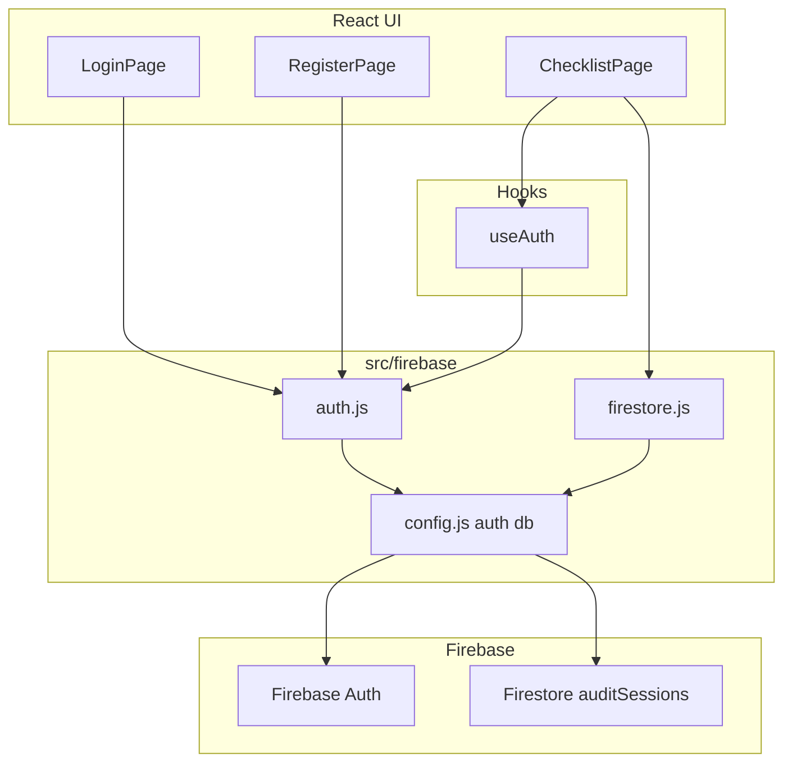
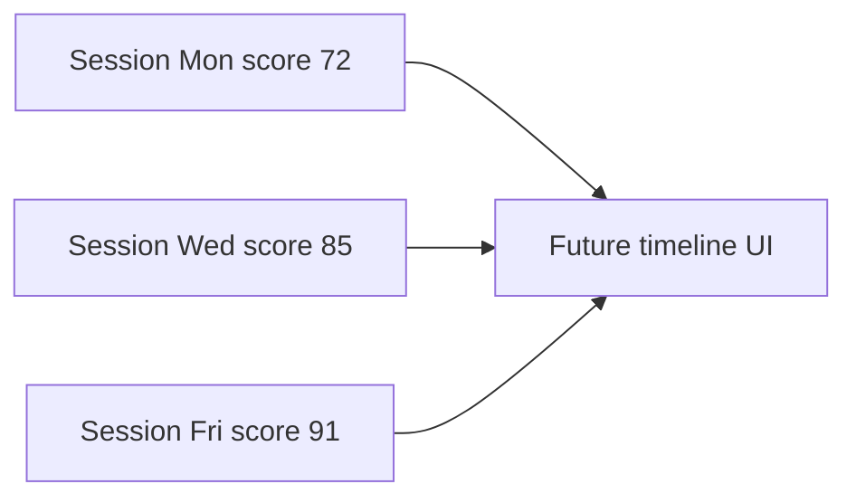

# Phase 2 — Firebase Auth and Firestore Progress

## Current state

Phase 1 is complete: [`ChecklistPage.jsx`](src/pages/ChecklistPage.jsx) owns `checkedItems` in React state only. All Firebase files are **comment stubs**:

- [`src/firebase/config.js`](src/firebase/config.js)
- [`src/firebase/auth.js`](src/firebase/auth.js)
- [`src/firebase/firestore.js`](src/firebase/firestore.js)
- [`src/hooks/useAuth.js`](src/hooks/useAuth.js)
- [`src/pages/LoginPage.jsx`](src/pages/LoginPage.jsx)
- [`src/pages/RegisterPage.jsx`](src/pages/RegisterPage.jsx)

[`package.json`](package.json) does **not** include `firebase` yet — install it before Step 1.

Your `.env.local` is already set up (and listed in [`.gitignore`](.gitignore)). Config will read `VITE_FIREBASE_*` vars exactly as documented in the [README Getting Started](README.md) section.

## Architecture (how Phase 2 connects to Phase 1)



**Rule from your project layout:** Firebase SDK calls stay in `src/firebase/` and `src/hooks/` — pages call helpers/hooks, never `firebase/auth` directly.

## Teaching approach (every step)

Per [react-dev skill](.cursor/skills/react-dev/SKILL.md) and [firebase-docs skill](.cursor/skills/firebase-docs/SKILL.md):

1. Explain the concept in plain language **before** code
2. Show code with section comments
3. Explain important lines and how it connects to Phase 1
4. Give exact browser tests before moving on

---

## Prerequisite — install Firebase SDK

```bash
npm install firebase
```

Firebase v10+ modular imports (`firebase/app`, `firebase/auth`, `firebase/firestore`). Restart `npm run dev` after install so Vite picks up the new dependency.

---

## Step 1 — [`src/firebase/config.js`](src/firebase/config.js)

**Concept:** Firebase must be initialized **once** at app startup. This file reads your secret config from environment variables and exports shared `auth` and `db` instances for every other Firebase file to import.

**Implementation:**

```js
import { initializeApp } from 'firebase/app';
import { getAuth } from 'firebase/auth';
import { getFirestore } from 'firebase/firestore';

const firebaseConfig = {
  apiKey: import.meta.env.VITE_FIREBASE_API_KEY,
  authDomain: import.meta.env.VITE_FIREBASE_AUTH_DOMAIN,
  projectId: import.meta.env.VITE_FIREBASE_PROJECT_ID,
  storageBucket: import.meta.env.VITE_FIREBASE_STORAGE_BUCKET,
  messagingSenderId: import.meta.env.VITE_FIREBASE_MESSAGING_SENDER_ID,
  appId: import.meta.env.VITE_FIREBASE_APP_ID,
};

const app = initializeApp(firebaseConfig);
export const auth = getAuth(app);
export const db = getFirestore(app);
```

**Test:** Temporarily add `console.log(import.meta.env.VITE_FIREBASE_PROJECT_ID)` in a page, run `npm run dev`, confirm your project ID prints and no `Firebase: Error (auth/invalid-api-key)` in console. Remove the log after.

---

## Step 2 — [`src/firebase/auth.js`](src/firebase/auth.js)

**Concept:** Thin wrappers around Firebase Auth so pages never touch the SDK directly. Each function uses `try/catch` and returns a **result object** instead of throwing — the UI decides how to show errors.

**Functions:**

| Function | Firebase modular API | Returns |
|----------|---------------------|---------|
| `registerUser(email, password)` | `createUserWithEmailAndPassword` | `{ user }` or `{ error: '...' }` |
| `loginUser(email, password)` | `signInWithEmailAndPassword` | `{ user }` or `{ error: '...' }` |
| `logoutUser()` | `signOut` | `{ success: true }` or `{ error: '...' }` |

**Error mapping helper** (private `getAuthErrorMessage(code)`):

| Firebase `error.code` | User-friendly message |
|-----------------------|----------------------|
| `auth/email-already-in-use` | An account with this email already exists. |
| `auth/invalid-credential` / `auth/wrong-password` | Incorrect email or password. |
| `auth/weak-password` | Password should be at least 6 characters. |
| `auth/invalid-email` | Please enter a valid email address. |
| default | Something went wrong. Please try again. |

Also export `subscribeToAuth(callback)` wrapping `onAuthStateChanged(auth, callback)` — used by `useAuth` in Step 3.

**Test:** In DevTools console (temporary), call helpers after importing — or wait until Step 4 forms exist. No uncaught promise rejections.

---

## Step 3 — [`src/hooks/useAuth.js`](src/hooks/useAuth.js)

**Concept:** A custom hook that answers: *"Is anyone logged in right now?"* It listens to Firebase Auth state and exposes `{ user, loading }` to any component.

**Why `useEffect` cleanup matters:**

```js
useEffect(() => {
  const unsubscribe = subscribeToAuth((firebaseUser) => {
    setUser(firebaseUser);
    setLoading(false);
  });
  return unsubscribe; // cleanup on unmount
}, []);
```

- `onAuthStateChanged` registers a **live listener**
- If you skip `return unsubscribe`, the listener keeps firing after the component unmounts → memory leak, React warnings, stale `setState` on unmounted components
- Start with `loading: true` so we don't flash "logged out" before Firebase responds

**Test:** Temporarily log `{ user, loading }` in `ChecklistPage` — should go `loading: true` → `loading: false`, `user: null` when logged out.

---

## Step 4 — [`RegisterPage.jsx`](src/pages/RegisterPage.jsx) + [`LoginPage.jsx`](src/pages/LoginPage.jsx)

**Concept:** Controlled forms with local state (`email`, `password`, `error`, `isSubmitting`). On submit → call auth helper → show error or redirect.

**Shared form pattern (both pages):**

- Tailwind styling matching Phase 1 (`max-w-md`, `rounded-xl border`, existing [`Button.jsx`](src/components/ui/Button.jsx))
- `type="submit"` on Button inside `<form onSubmit={handleSubmit}>`
- Disable button + show "Signing in..." / "Creating account..." while `isSubmitting`
- `useNavigate()` from React Router — on success: `navigate('/checklist')`
- Cross-links: Login page → "Don't have an account? Register", Register → "Already have an account? Log in"

**Also update [`src/App.jsx`](src/App.jsx)** (required to test Step 4):

```jsx
<Route path="/login" element={<LoginPage />} />
<Route path="/register" element={<RegisterPage />} />
```

Keep `/checklist` and `/` redirect as-is.

**Tests:**

| Page | Action | Expected |
|------|--------|----------|
| `/register` | New email + password (6+ chars) | Redirect to `/checklist`, user visible in Firebase Console → Authentication |
| `/register` | Same email again | Red error: "account already exists" |
| `/login` | Correct credentials | Redirect to `/checklist` |
| `/login` | Wrong password | Red error message, stays on page |
| Both | Submit with empty fields | HTML5 validation or friendly error |

---

## Step 5 — [`src/firebase/firestore.js`](src/firebase/firestore.js)

**Concept:** Persist checklist progress to Firestore so it survives page refresh. Matches the README ER diagram: `auditSessions` is a **collection of many documents** — one row per audit session over time, not one overwritable doc per user.

**Document path:** `auditSessions/{sessionId}` where `sessionId` is **auto-generated** by Firestore (`addDoc`).

**Fields on each session document:**

| Field | Type | Phase 2 value |
|-------|------|---------------|
| `userId` | string | Firebase Auth `uid` |
| `completedItems` | string[] | same ids as Phase 1 `checkedItems` |
| `date` | timestamp | `serverTimestamp()` on create/update |
| `score` | number | `0` (real scoring comes later) |
| `categoryScores` | object | `{ onPage: 0, technical: 0, content: 0 }` placeholders |

**Save logic (`saveAuditSession(userId, checkedItems)`):**

1. Query `auditSessions` where `userId == userId`, `orderBy('date', 'desc')`, `limit(1)`
2. If a doc exists **and** its `date` is **today** (same calendar day, local timezone) → `updateDoc` that session's `completedItems` and `date`
3. Otherwise → `addDoc` a **new** session with all fields above

This avoids creating a new document on every checkbox tick, while still allowing a **new session tomorrow** (and eventually a full history of sessions).

**Load logic (`loadAuditSession(userId)`):**

1. Same query: `userId == userId`, `orderBy('date', 'desc')`, `limit(1)`
2. Return `{ completedItems }` from that doc, or `{ completedItems: [] }` if none exists

**Firestore composite index required:** `auditSessions` — `userId` Ascending + `date` Descending (Firebase Console will show a link in the error if missing).

**Connection to future progress timeline:**



Each `auditSessions` document is a **point-in-time snapshot**. Phase 2 stores `completedItems` and placeholder `score`/`categoryScores`. Later phases will:
- Calculate real scores from `completedItems` + item weights
- Query **all** sessions for a user (`orderBy date`) to render a score-over-time chart
- Phase 2's daily session rule means one audit per day without duplicate docs — tomorrow's ticks create a fresh session, building natural history

**Offline / no internet:**

- `getDocs` / `addDoc` / `updateDoc` reject with codes like `unavailable`
- Catch in helper, return `{ error: 'Unable to reach the server. Check your internet connection.' }`
- Phase 1 checklist UI still works in React state; save/load failures show a non-blocking error banner on `ChecklistPage` (Step 6) — ticks are not lost locally

**Test (Firebase Console):**

1. Log in, tick 2 items on `/checklist` (after Step 6)
2. Firestore → `auditSessions` → one new doc with auto-generated ID
3. Tick another item → **same** doc updated (not a second doc)
4. Confirm fields: `userId`, `completedItems`, `date`, `score: 0`, `categoryScores`
5. (Optional) Manually change a doc's `date` to yesterday in Console, tick again → **new** doc created

---

## Step 6 — Update [`src/pages/ChecklistPage.jsx`](src/pages/ChecklistPage.jsx)

**Concept:** Bridge Phase 1 state with Firebase. Logged-in users load saved progress on mount and auto-save on every toggle. Guests keep Phase 1 behavior exactly.

**New imports/state:**

```js
const { user, loading: authLoading } = useAuth();
const [sessionLoading, setSessionLoading] = useState(false);
const [saveError, setSaveError] = useState('');
```

**Load on mount (logged in only):**

```js
useEffect(() => {
  if (authLoading || !user) return;
  const loadProgress = async () => {
    setSessionLoading(true);
    const result = await loadAuditSession(user.uid);
    if (result.error) setSaveError(result.error);
    else if (result.completedItems) setCheckedItems(result.completedItems);
    setSessionLoading(false);
  };
  loadProgress();
}, [user, authLoading]);
```

**Save on toggle:**

```js
const handleToggleItem = async (itemId) => {
  const nextChecked = /* compute new array */;
  setCheckedItems(nextChecked);           // instant UI (Phase 1 behavior)
  if (user) {
    const result = await saveAuditSession(user.uid, nextChecked);
    if (result.error) setSaveError(result.error);
    else setSaveError('');
  }
};
```

**UI additions:**

| State | UI |
|-------|-----|
| `authLoading \|\| sessionLoading` | Show existing [`LoadingSpinner.jsx`](src/components/ui/LoadingSpinner.jsx) or simple "Loading your progress..." |
| `!user && !authLoading` | Amber banner: "Log in to save your progress" with link to `/login` (reuse Phase 1 card styling) |
| `saveError` | Red dismissible banner below header — checklist still usable |

**Phase 1 behavior preserved for guests:** no Firestore calls, `checkedItems` starts `[]`, refresh clears ticks.

**Full integration tests:**

1. **Guest:** `/checklist` → tick items → refresh → ticks gone, banner visible
2. **Register → checklist:** tick 3 items → refresh → 3 items still checked
3. **Logout (console `logoutUser()` for now) → tick items → refresh → gone
4. **Login again:** previous 3 items restored
5. **Wrong password on login:** error shown, no crash
6. **DevTools offline:** tick while logged in → local state updates, save error banner appears

---

## Files touched (summary)

| Step | File(s) | Action |
|------|---------|--------|
| 0 | `package.json` | `npm install firebase` |
| 1 | `config.js` | Implement |
| 2 | `auth.js` | Implement |
| 3 | `useAuth.js` | Implement |
| 4 | `RegisterPage.jsx`, `LoginPage.jsx`, `App.jsx` | Implement + routes |
| 5 | `firestore.js` | Implement |
| 6 | `ChecklistPage.jsx` | Load/save + guest banner |

**Out of scope for Phase 2:** Security Rules hardening (test mode is fine for now), real score calculation, PDF export, Navbar logout button, progress timeline UI, `users` collection writes.

**Post-Phase 2 reminder:** Before production, replace Firestore test mode with rules on `auditSessions` where `request.auth.uid == resource.data.userId` (and on create, `request.auth.uid == request.resource.data.userId`).

---

## Execution order when approved

Implement **one file at a time** (Step 4 = RegisterPage, then LoginPage, then App routes), pausing after each with full beginner explanation and browser tests before continuing.
