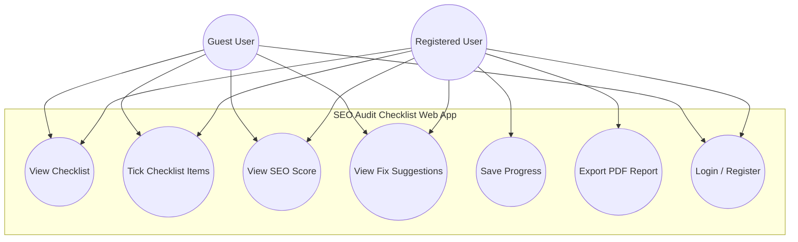
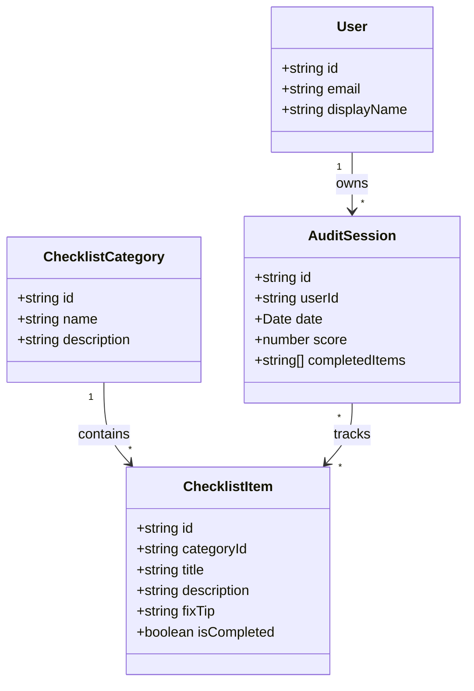
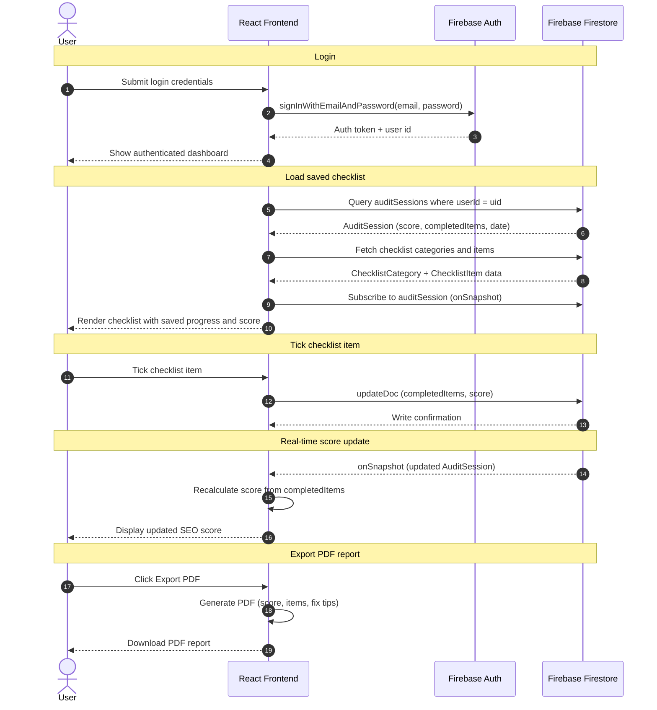
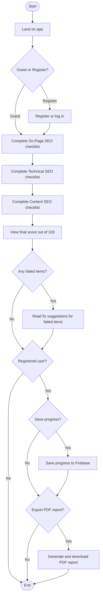
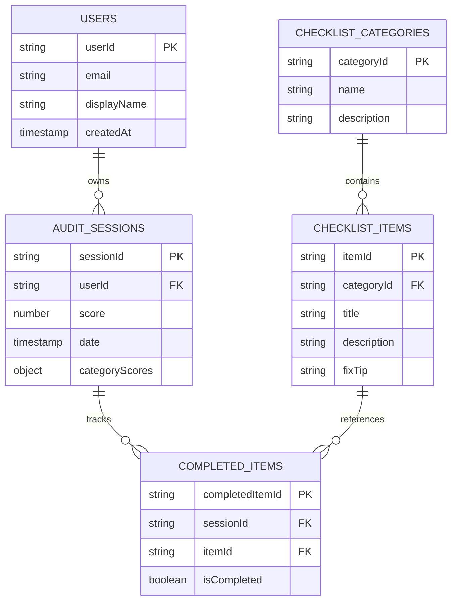

# SEO-Audit-Checklist-App

An interactive web app that guides you through a structured SEO audit using a step-by-step checklist. Work through On-Page, Technical, and Content SEO checks, see your score update as you go, and get actionable fix suggestions for anything you miss.

**Who it's for:** website owners, marketers, and developers who want a clear, repeatable way to assess and improve a site's SEO without needing specialist tools.

**[Live Demo — coming soon](#)**

**Built with:** React · Firebase · Netlify

## Features

- [ ] Interactive SEO checklist with three categories (On-Page, Technical, Content SEO)
- [ ] Live score out of 100 that updates in real time
- [ ] Colour coded score indicator (red, orange, green)
- [ ] Fix suggestions for every failed item
- [ ] Firebase authentication (register and login)
- [ ] Save progress to Firebase Firestore
- [ ] Export full audit report as PDF
- [ ] Mobile responsive design

## Tech Stack


| Technology         | Purpose                                           |
| ------------------ | ------------------------------------------------- |
| React              | Component-based UI and real-time state management |
| Firebase Auth      | Secure user authentication                        |
| Firebase Firestore | Real-time database for saving audit sessions      |
| jsPDF or react-pdf | Generating downloadable PDF reports               |
| Netlify            | Free hosting with automatic GitHub deploys        |
| Tailwind CSS       | Fast responsive styling                           |


## Getting Started

### 1. Clone the repository

```bash
git clone https://github.com/banelemazibuko/SEO-Audit-Checklist-App.git
cd SEO-Audit-Checklist-App
```

### 2. Install dependencies

```bash
npm install
```

### 3. Set up Firebase

1. Create a project in the [Firebase Console](https://console.firebase.google.com/).
2. Enable **Authentication** (Email/Password) and **Firestore Database**.
3. Register a web app in your Firebase project and copy the config values.
4. Create a `.env.local` file in the project root with the following variables:

```env
VITE_FIREBASE_API_KEY=your_api_key
VITE_FIREBASE_AUTH_DOMAIN=your_project.firebaseapp.com
VITE_FIREBASE_PROJECT_ID=your_project_id
VITE_FIREBASE_STORAGE_BUCKET=your_project.appspot.com
VITE_FIREBASE_MESSAGING_SENDER_ID=your_sender_id
VITE_FIREBASE_APP_ID=your_app_id
```

> **Note:** Never push `.env.local` to GitHub. It contains sensitive credentials and is already listed in `.gitignore`.

### 4. Run the development server

```bash
npm run dev
```

Open the URL shown in the terminal (typically `http://localhost:5173`) to use the app locally.

## Screenshots

Checklist Screen
Score Screen
PDF Export

*Screenshots will be added once the app is built.*

## Use Case Diagram




A guest registers via **Login / Register** to become a registered user. A registered user logs in via the same use case to access their saved progress.

### Actor–Use Case Relationships


| Use Case             | Guest User | Registered User |
| -------------------- | ---------- | --------------- |
| View checklist       | ✓          | ✓               |
| Tick checklist items | ✓          | ✓               |
| View SEO score       | ✓          | ✓               |
| View fix suggestions | ✓          | ✓               |
| Save progress        |            | ✓               |
| Export PDF report    |            | ✓               |
| Login / register     | ✓          | ✓               |


## Class Diagram

React frontend with Firebase (Auth for users, Firestore for audit sessions and checklist data).




### Class Relationships


| Relationship                      | Cardinality | Description                                           |
| --------------------------------- | ----------- | ----------------------------------------------------- |
| User → AuditSession               | 1 : *       | A user owns many audit sessions (`userId`)            |
| ChecklistCategory → ChecklistItem | 1 : *       | A category groups many checklist items (`categoryId`) |
| AuditSession → ChecklistItem      | * : *       | A session tracks completed items via `completedItems` |


## Sequence Diagram

This diagram shows the end-to-end flow for a registered user returning to the app: they log in via Firebase Auth, load their saved audit session and checklist from Firestore, tick a checklist item, receive an updated SEO score in real time through a Firestore listener, and export a PDF report from the React frontend.




### Sequence Steps


| Step | From               | To                 | Action                       | Description                                                       |
| ---- | ------------------ | ------------------ | ---------------------------- | ----------------------------------------------------------------- |
| 1    | User               | React Frontend     | Submit login credentials     | User enters email and password and submits the login form         |
| 2    | React Frontend     | Firebase Auth      | signInWithEmailAndPassword   | React authenticates the user against Firebase Auth                |
| 3    | Firebase Auth      | React Frontend     | Return auth token + user id  | Auth confirms identity and returns session credentials            |
| 4    | React Frontend     | User               | Show authenticated dashboard | UI updates to reflect the logged-in state                         |
| 5    | React Frontend     | Firebase Firestore | Query auditSessions          | React fetches the user's saved audit session by `userId`          |
| 6    | Firebase Firestore | React Frontend     | Return AuditSession          | Firestore returns score, `completedItems`, and session metadata   |
| 7    | React Frontend     | Firebase Firestore | Fetch checklist data         | React loads categories and items for the checklist template       |
| 8    | Firebase Firestore | React Frontend     | Return checklist data        | Firestore returns `ChecklistCategory` and `ChecklistItem` records |
| 9    | React Frontend     | Firebase Firestore | Subscribe via onSnapshot     | React sets up a real-time listener on the audit session           |
| 10   | React Frontend     | User               | Render checklist             | UI shows items with saved completion state and current score      |
| 11   | User               | React Frontend     | Tick checklist item          | User marks an item as complete                                    |
| 12   | React Frontend     | Firebase Firestore | updateDoc                    | React persists the updated `completedItems` and score             |
| 13   | Firebase Firestore | React Frontend     | Write confirmation           | Firestore confirms the document was updated                       |
| 14   | Firebase Firestore | React Frontend     | onSnapshot push              | Listener delivers the updated `AuditSession` in real time         |
| 15   | React Frontend     | React Frontend     | Recalculate score            | React derives the new SEO score from completed items              |
| 16   | React Frontend     | User               | Display updated score        | UI refreshes to show the new score immediately                    |
| 17   | User               | React Frontend     | Click Export PDF             | User requests a downloadable audit report                         |
| 18   | React Frontend     | React Frontend     | Generate PDF                 | React builds the report with score, items, and fix tips           |
| 19   | React Frontend     | User               | Download PDF report          | Browser downloads the generated PDF file                          |


## Activity Diagram

This diagram shows the full user journey through the SEO Audit Checklist app: landing on the homepage, choosing to continue as a guest or register, working through the three checklist categories in order (On-Page SEO, Technical SEO, Content SEO), viewing a final score out of 100, reviewing fix suggestions for any failed items, and then optionally saving progress, exporting a PDF report, or doing both (save and export are available to registered users only).




### Activity Steps


| Step | Type     | Node                                  | Description                                                                                                        |
| ---- | -------- | ------------------------------------- | ------------------------------------------------------------------------------------------------------------------ |
| 1    | Start    | Start                                 | User opens the SEO Audit Checklist app                                                                             |
| 2    | Activity | Land on app                           | Landing page loads and presents entry options                                                                      |
| 3    | Decision | Guest or Register?                    | User chooses to continue as a guest or create an account / log in                                                  |
| 4    | Activity | Register or log in                    | User completes registration or signs in (register path only)                                                       |
| 5    | Activity | Complete On-Page SEO checklist        | User reviews and ticks items in the first category                                                                 |
| 6    | Activity | Complete Technical SEO checklist      | User reviews and ticks items in the second category                                                                |
| 7    | Activity | Complete Content SEO checklist        | User reviews and ticks items in the third category                                                                 |
| 8    | Activity | View final score out of 100           | App displays the overall SEO score based on completed items                                                        |
| 9    | Decision | Any failed items?                     | App checks whether any checklist items were not completed                                                          |
| 10   | Activity | Read fix suggestions for failed items | User reads `fixTip` guidance for each incomplete item                                                              |
| 11   | Decision | Registered user?                      | Determines whether save and export options are available                                                           |
| 12   | Decision | Save progress?                        | Registered user chooses whether to persist the audit session to Firebase                                           |
| 13   | Activity | Save progress to Firebase             | Audit session, score, and completed items are stored in Firestore                                                  |
| 14   | Decision | Export PDF report?                    | Registered user chooses whether to download a PDF summary                                                          |
| 15   | Activity | Generate and download PDF report      | App builds a PDF with score, items, and fix tips and triggers download                                             |
| 16   | End      | End                                   | User finishes the audit flow (guests exit after fix suggestions; registered users exit after optional save/export) |


## ER Diagram

This diagram models the Firebase Firestore database for the SEO Audit Checklist app. Registered users are stored in `users`; each user owns one or more `auditSessions` with an overall score, per-category scores, and session date. Checklist structure is defined by `checklistCategories` and `checklistItems` (template data). The `completedItems` collection links each audit session to checklist items and records whether each item was completed.




### Collections and Fields


| Collection          | Field           | Type      | Key | Description                                                                |
| ------------------- | --------------- | --------- | --- | -------------------------------------------------------------------------- |
| users               | userId          | string    | PK  | Unique identifier for the user (Firestore document ID / Firebase Auth UID) |
| users               | email           | string    |     | User's email address                                                       |
| users               | displayName     | string    |     | User's display name shown in the app                                       |
| users               | createdAt       | timestamp |     | When the user account was created                                          |
| auditSessions       | sessionId       | string    | PK  | Unique identifier for an audit session                                     |
| auditSessions       | userId          | string    | FK  | References `users.userId` — owner of the session                           |
| auditSessions       | score           | number    |     | Overall SEO score out of 100                                               |
| auditSessions       | date            | timestamp |     | Date and time the audit session was created or last updated                |
| auditSessions       | categoryScores  | object    |     | Per-category scores: `onPage`, `technical`, `content` (each a number)      |
| checklistCategories | categoryId      | string    | PK  | Unique identifier for a checklist category                                 |
| checklistCategories | name            | string    |     | Category name (e.g. On-Page SEO, Technical SEO, Content SEO)               |
| checklistCategories | description     | string    |     | Brief description of what the category covers                              |
| checklistItems      | itemId          | string    | PK  | Unique identifier for a checklist item                                     |
| checklistItems      | categoryId      | string    | FK  | References `checklistCategories.categoryId`                                |
| checklistItems      | title           | string    |     | Short title of the checklist item                                          |
| checklistItems      | description     | string    |     | Detailed description of the audit check                                    |
| checklistItems      | fixTip          | string    |     | Suggestion shown when the item is not completed                            |
| completedItems      | completedItemId | string    | PK  | Unique identifier for a completion record                                  |
| completedItems      | sessionId       | string    | FK  | References `auditSessions.sessionId`                                       |
| completedItems      | itemId          | string    | FK  | References `checklistItems.itemId`                                         |
| completedItems      | isCompleted     | boolean   |     | Whether the item was ticked/completed in this session                      |


### Collection Relationships


| From                | To             | Cardinality | Via        | Description                                                |
| ------------------- | -------------- | ----------- | ---------- | ---------------------------------------------------------- |
| users               | auditSessions  | 1 : N       | userId     | A user can have many audit sessions                        |
| checklistCategories | checklistItems | 1 : N       | categoryId | A category groups many checklist items                     |
| auditSessions       | completedItems | 1 : N       | sessionId  | A session tracks completion state for many items           |
| checklistItems      | completedItems | 1 : N       | itemId     | An item can appear in many sessions via completion records |


## License

This project is licensed under the MIT License. See the [LICENSE](LICENSE) file for details.

Copyright (c) 2026 Banele Chakuma